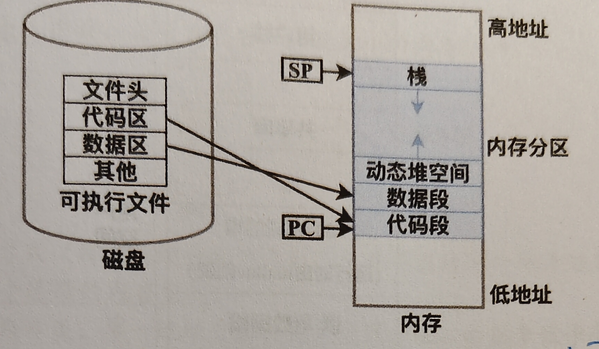

+++
title = "3.1 程序装入"
date = 2026-05-16T22:03:58+08:00
lastmod = 2026-05-16T22:03:58+08:00
draft = false
weight = 31
slug = "program-loading"
summary = "链接、装入、重定位、内存保护与程序内存布局的核心知识整理。"
tags = ["操作系统", "装入", "链接", "408"]
categories = ["操作系统"]
+++

# 程序装入

**重点**

## 1. 本质

程序的完整周期为编译、链接、装入。

在计组中学习了编译过程，包括预处理、编译、汇编；本章节重点讨论链接与装入。

---

## 2. 结构/组成

### 链接

将多个模块合并时，需要对各个模块重新编址。

1. 静态链接
   形成完整模块后，不可以再拆开，可以直接装入内存中。
2. 装入时链接
   具有以下优点：
   - 便于修改和更新
   - 便于对目标模块的共享

这里常结合共享库来理解。多个进程运行时，可以共同链接到同一个已装入内存的目标模块。

由于共享库代码采用位置无关技术，其代码段可被多个进程共享映射，因此无需为每个进程复制一份目标模块，从而实现目标模块共享并节省内存。

常和以下内容联合出题：

- 虚拟内存
- 页表
- 动态链接
- 共享库

注意：**共享的是物理页，不是共享虚拟地址。**

3. 运行时链接
   加快了程序装入过程，同时可以节省大量内存空间。

### 装入

涉及到虚拟地址到物理地址的转换，也叫 **地址映射** 或 **重定位**。

1. 绝对装入
   适用于单道程序，在链接时直接写好了真实物理地址，因此可以直接装入。
2. 可重定位装入（静态重定位）
   在装入时，对指令代码直接修改，把其中的逻辑地址改成真实物理地址。因此装入后程序不能再移动。
3. 动态运行时装入（动态重定位）
   在装入时，不修改指令代码中的地址，而是借助 **基地址寄存器** 来寻找真正的物理地址。

### 内存保护

在多道程序中，为了防止 A 程序访问到 B 程序的空间，设置限长寄存器进行保护。

- 这里可以和用户空间、内核空间联系起来理解
- 注意设置基地址寄存器和限长寄存器时必须使用特权指令

### 程序在内存中的分区结构

当各个模块链接为整体后，也就是形成可执行文件，通常包括以下部分：

- 文件头：描述信息
- 代码区：程序指令
- 数据区：程序的全局变量
- 其它

装入内存后，通常关注：

- 代码段
- 数据段
- 用户栈
- 堆

这部分可以联系计组中 x86 的过程调用一起理解。

### 地址空间

注意这里是单个进程的虚拟地址空间。

- 内核空间：与操作系统有关，进程的 PCB 信息也在这里
- 用户栈：用来保存局部变量
- 共享库：与装入时链接有关，常见 C 语言中的各种库函数
- 堆：常见 C 语言中的 `malloc` 函数
- 数据段：全局变量
- 代码段：程序指令

---

## 3. 核心操作

- 后续补充

---

## 4. 常考点

- 装入方式和重定位方式的区别
- 静态链接、装入时链接、运行时链接的特点
- 共享库为什么能节省内存
- 基地址寄存器和限长寄存器的作用

---

## 5. 易错点

- 不要把“共享物理页”和“共享虚拟地址”混为一谈
- 不要把静态重定位和动态重定位混淆
- 链接和装入不是同一个阶段

---

## 6. 关联知识

- 虚拟内存
- 页表
- 动态链接
- 共享库
- 用户空间与内核空间

---

## 7. 真题记录

- 2022 选择题第 X 题
