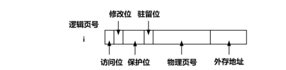
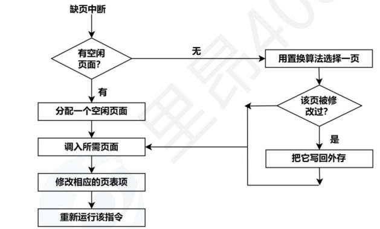
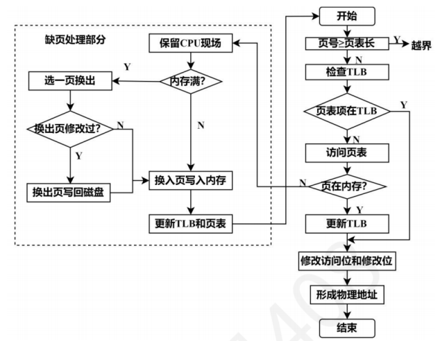

+++

title = '3.4 虚拟分页管理'

date = 2026-05-18T17:00:00+08:00

lastmod = 2026-05-18T17:00:00+08:00

publishDate = 2026-05-18T17:00:00+08:00

draft = false

weight = 34

slug = "virtual-paging-management"

summary = "利用局部性原理，使得内存可以尽可能装入更多的程序，从而提高系统的并发性。"

tags = []

categories = ["操作系统"]

+++

  

**重点**
**易错**
**易混**
  

## 1. 本质
传统的内存管理，要求进程的逻辑地址空间必须要小于物理地址空间；而利用程序访问的局部性原理，使用虚拟分页管理，让内存可以容纳更多的程序，从而提高系统的并发性。
  从而需要满足**请求调入功能**和**置换功能**。
  - 多次性：作业允许多次调入内存
  - 对换性：联系进程管理中的中级调度
  - 虚拟性：是以多次性和对换性为基础

## 2. 结构/组成
虚拟分页管理是以分页管理为基础，增加了==请求分页==等功能。
需要硬件支持和软件支持。进程运行时，使用==MMU==进行地址映射。本小节讨论硬件支持。
### 请求页表机制
在分页管理的页表基础上，增加了：
- 外存地址：用于页面置换时，找寻该页对应的磁盘地址
- 驻留位：判断该页是否处于内存中
- 保护位：设置不同的权限
- 修改位：用于页面置换，作用与其算法，同时也判断是否向磁盘写入
- 访问位：用于页面置换算法
	注意当给出逻辑地址后，计算其物理地址除了使用分页管理中的计算方法，还有
	```
	物理地址=页框号*页面大小+页内地址
	```

### 缺页中断
当要访问的页没在没在内存中，由MMU发出缺页中断，属于==内部异常==。该进程会发生阻塞，当IO操作结束后，该进程变为就绪态。
发生页面置换时，所修改的页表项
	旧页表项：将驻留位置为0
	新页表项：驻留位和访问位置为1
当处理结束后，会重新执行该指令。

### 具有快表的地址变换

### 内存分配
联系上节中所说的==物理页表==，OS为每一个进程分配的页框集合称为==驻留集==。
显然当驻留集越小，并发性越高，但缺页中断率也越高。
驻留集越大，当超过某个数目后，改善缺页中断率不明显（进程运行时，可能仅仅需要某几个页，不需要很多的页），但并发性降低。
从而有内存分配和页面置换两方面的考虑。
- 内存分配
	固定分配：要求从始至终，进程获得的驻留集大小不变。
	可变分配：进程运行时，驻留集大小发生了改变。
	物理块分配：
		1. 平均分配：容易导致部分进程获得的物理块一直没有利用到；而有的进程发生中断。
		2. 按比例分配
		3. 按优先级分配
- 页面置换
	全局置换：允许在除了驻留集外，选择空白物理块分配给该进程。从而，全局置换只能和可变分配配对。
	局部置换：只允许在自己的驻留集内进行置换。
1. 固定分配局部置换
2. 可变分配全局置换：发生置换时，就会增加驻留集大小。最终中断率改善不明显，而系统并发性降低。
3. 可变分配局部置换：当频繁发生中断时，会增大驻留集。但是该方法会增大系统开销。
### 页面调入
时间：
1. 预调页：利用局部性原理，发生在进程运行前
2. 请求调页：发生在运行期间，每次仅调入一页

地点：
1. 交换区：在运行前，将所有文件从文件区复制到交换区中。
2. 文件区：对于不会发生修改的文件都在文件区；发生修改的文件则在交换区。
3. UNIX方式：起初都在文件区，后续发生在交换区。

## 3. 核心操作
- 后续补充

  

---
  

## 4. 常考点
- 后续补充

  

---
  

## 5. 易错点
- 后续补充

  

---
  

## 6. 关联知识
- 后续补充

  

---
  

##  7. 真题记录
- 后续补充

  

---
